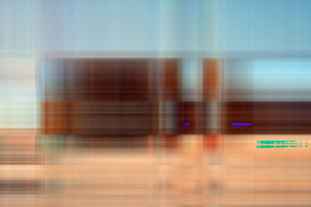

**Хранения промежуточного сжатого представления использует следующий формат файла:**
- заголовочные: width, height, compression_factor (все np.uint32)
- само сингулярное разложение по трём цветам (RGB) в трёх массивах, размера: `width compression_factor`, `compression_factor`,  `k * compression_factor`. Все числа в массивах типа float32.

**Изначальная картинка**

**Запуск для разных методов и разных сжатий**

| Метод | N = 2 | N = 3 | N = 5 | N = 10 | N = 20 | N = 50 |
|-------|-------|-------|-------|--------|--------|--------|
| **numpy** |  |  |  |  |  |  |
| **simple** |  |  |  |  |  |  |
| **advanced** |  |  |  |  |  |  |

Метод **advanced** взят [отсюда](https://www.degruyter.com/document/doi/10.1515/jisys-2018-0034/html)

Такая же посмотрим на эту же картинку худшего качества и меньшего размера, сжата *numpy*:

| N = 2 | N = 3 | N = 5 | N = 10 | N = 20 | N = 30 |
|-------|-------|-------|--------|--------|--------|
|  |  |  |  |  |  |

**Вывод**

Заметим что видимой глазу разницы в различных сжатиях нет. Картинка худжшего качества, как и ожидалось, при сжатии становится хужшего качества, чем боллее тяжелый аналог. *Numpy* работает заметно быстрее остальных.